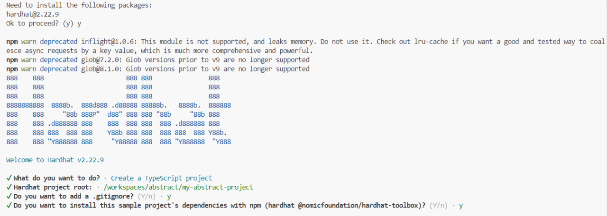
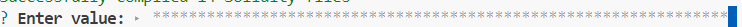

<h2 align=center>ABSTRACT</h1l2>
<h3 align=center>DEPLOY SMART-CONTRACT IN ABSTRACT CHAIN FOR POTENTIAL AIRDROP</h1l2>

## WORKSPACE
Use it: [Github Codespace](https://github.com/codespaces)
## PREPARE
you need 0.01 ETH in abstract chain. You can use [bridge](https://portal.testnet.abs.xyz/bridge/withdraw)
## COMMAND
Paste the below command to interact with Abstract

```bash
wget https://raw.githubusercontent.com/MikeHitman/abstract/main/abstract.sh && chmod +x abstract.sh && ./abstract.sh
```

Then press enter


Paste your private key


Then paste your contract address

## WELL DONE
If you liked it and want more interesting interactions with projects, subscribe to me  [@NoworkNoresult](https://x.com/NoworkNoresult)
